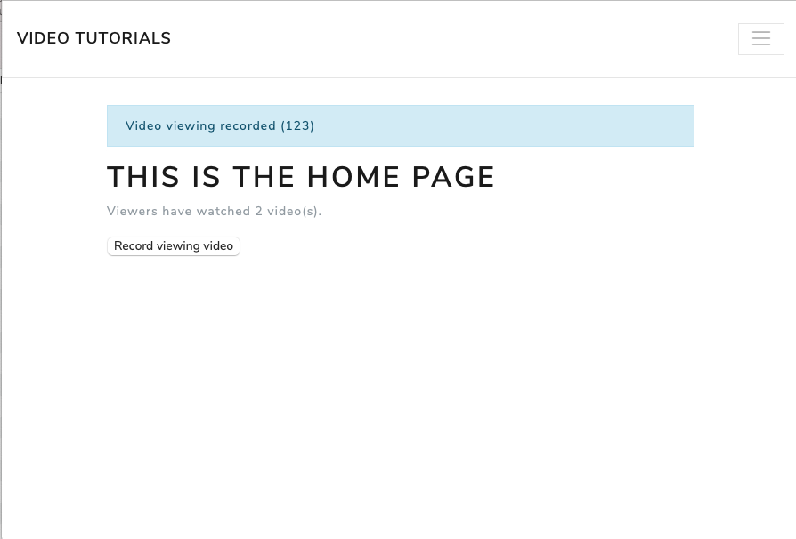
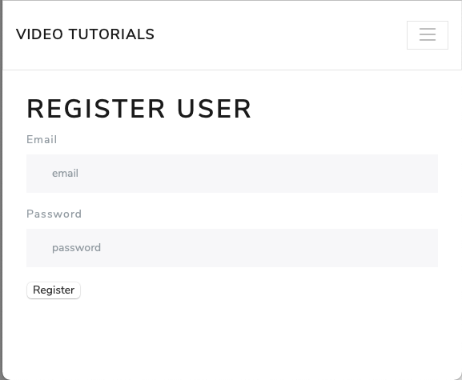
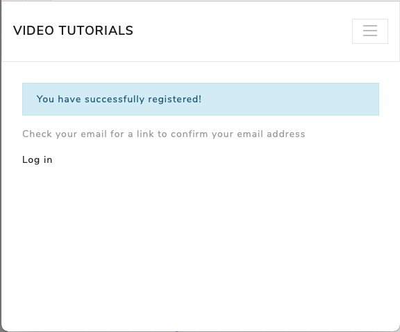
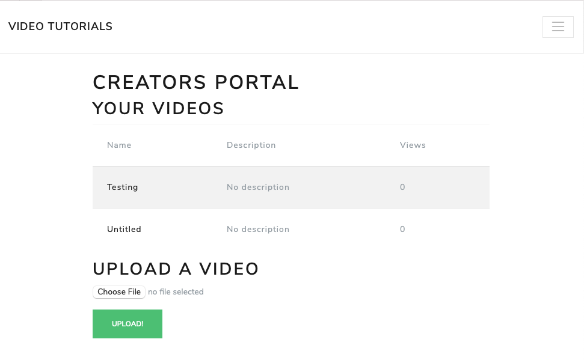
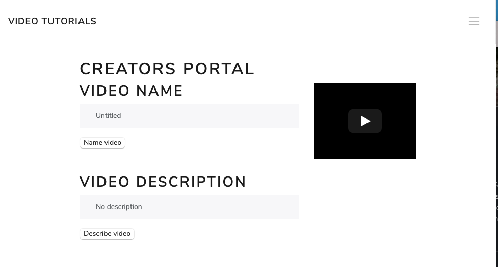
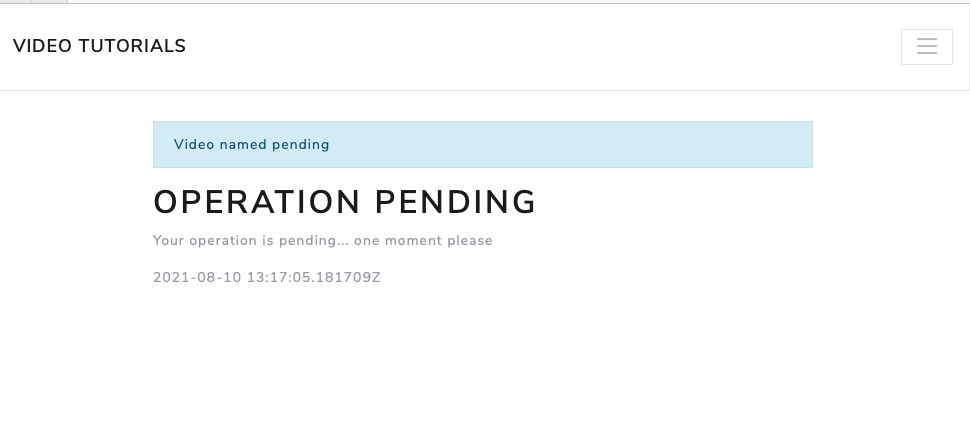
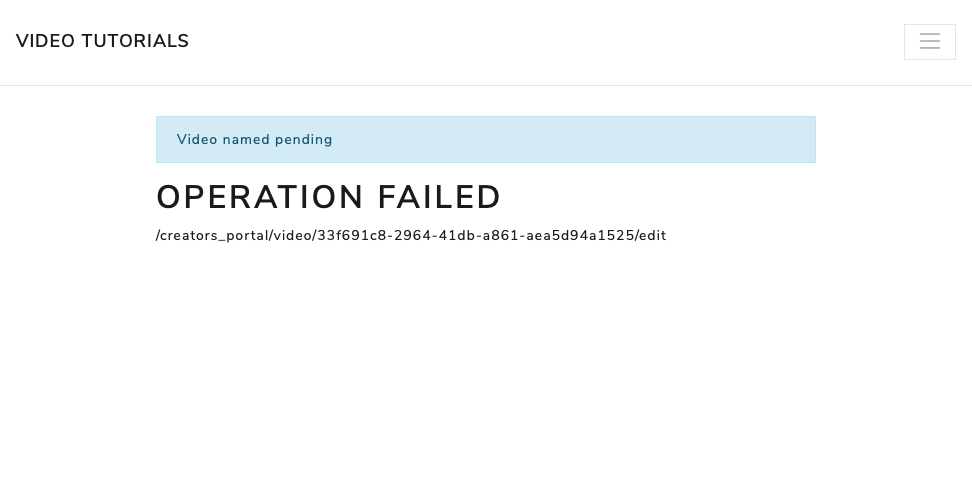

# Guided Tour

## Recording Video Views

A simple demonstration of recording video views as events and aggregating the page view data.

### Chapters (Part I - Fundamentals)

1. You Have a New Project
2. Writing Messages
3. Putting Data in a Message Store
4. Projecting Data into Useful Shapes
5. Subscribing to the Message Store

### Steps

1. Visit the home page: http://localhost:4000
2. Click the "Record viewing video" button twice.



### Messages

Summary:

1. `VideoViewed` event

Details:

`VideoViewed` events are recorded in the message store to the `viewing` stream:

```
video_tutorials_dev# select * from message_store.messages where type = 'VideoViewed';
                  id                  │ stream_name │    type     │ position │ global_position │               data                │           metadata            │            time
══════════════════════════════════════╪═════════════╪═════════════╪══════════╪═════════════════╪═══════════════════════════════════╪═══════════════════════════════╪════════════════════════════
 9e0e2394-ea05-45db-8cc4-639079c01e79 │ viewing-123 │ VideoViewed │        0 │               6 │ {"user_id": 0, "video_id": "123"} │ {"user_id": 0, "trace_id": 0} │ 2021-08-04 20:05:11.884972
 7b0290e3-a4ad-403f-b9e3-4793c1f83a56 │ viewing-123 │ VideoViewed │        1 │              10 │ {"user_id": 0, "video_id": "123"} │ {"user_id": 0, "trace_id": 0} │ 2021-08-04 20:05:18.064807
```

### View Data

`VideoViewed` events are aggregated in the `pages` table:

```
video_tutorials_dev# select * from pages;
                  id                  │ name │                       data
══════════════════════════════════════╪══════╪══════════════════════════════════════════════════
 f5e01e2e-9aaf-4122-a7a3-f4808af453cd │ home │ {"videos_watched": 2, "last_view_processed": 10}
```
## Registering Users

Demonstrate the registration of a user by writing a command and an event. User credential view
data is aggregated based on the registered event.

### Chapters (Part II - Fleshing Out the System)

6. Registering Users
7. Implementing Your First Component
8. Authenticating Users

### Steps

1. Visit the registration page: http://localhost:4000/register
2. Complete the registration form (e.g. email:jane@example.com, password:adminadmin)




### Messages

Summary:

1. `identity:command` - `Register`
2. `identity` - `Registered`

Details:

`Register` commands are written in message store to the `identity` command stream:

```
video_tutorials_dev# select * from message_store.messages where type = 'Register';

                  id                  │                      stream_name                      │   type   │ position │ global_position │                                                                               data                                                                                │                                                metadata
══════════════════════════════════════╪═══════════════════════════════════════════════════════╪══════════╪══════════╪═════════════════╪═══════════════════════════════════════════════════════════════════════════════════════════════════════════════════════════════════════════════════════════════════╪═════════════════════════════════════════════════════════════════
 24729a4d-dcc0-4600-a378-866200591bb4 │ identity:command-6106fbf0-8c92-4493-bdd4-309f62bcca29 │ Register │        0 │              14 │ {"email": "jane@example.com", "user_id": "6106fbf0-8c92-4493-bdd4-309f62bcca29", "password_hash": "$2a$12$BfrnrGg3vnE3GhynopOvxuoHXtOY2cSB7nkQp2lmrV01/dVFwe.Ia"} │ {"user_id": "6106fbf0-8c92-4493-bdd4-309f62bcca29", "trace_id":
```
`Registered` events are written in the message store to the `identity` stream:

```
video_tutorials_dev# select * from message_store.messages where type = 'Registered';

                  id                  │                  stream_name                  │    type    │ position │ global_position │                                                                               data                                                                                │                                                metadata
══════════════════════════════════════╪═══════════════════════════════════════════════╪════════════╪══════════╪═════════════════╪═══════════════════════════════════════════════════════════════════════════════════════════════════════════════════════════════════════════════════════════════════╪═══════════════════════════════════════════════════════════════════════
 471481e1-81e5-4f85-bbfb-5f543bbf9eab │ identity-6106fbf0-8c92-4493-bdd4-309f62bcca29 │ Registered │        0 │              15 │ {"email": "jane@example.com", "user_id": "6106fbf0-8c92-4493-bdd4-309f62bcca29", "password_hash": "$2a$12$BfrnrGg3vnE3GhynopOvxuoHXtOY2cSB7nkQp2lmrV01/dVFwe.Ia"} │ {"user_id": "6106fbf0-8c92-4493-bdd4-309f62bcca29", "trace_id": "85cd2
```

### View Data

`Registered` events are aggregated in the `user_credentials` table:

```
video_tutorials_dev# select * from user_credentials;

                  id                  │      email       │                        password_hash
══════════════════════════════════════╪══════════════════╪══════════════════════════════════════════════════════════════
 6106fbf0-8c92-4493-bdd4-309f62bcca29 │ jane@example.com │ $2a$12$BfrnrGg3vnE3GhynopOvxuoHXtOY2cSB7nkQp2lmrV01/dVFwe.Ia
```

## Sending an Email

Demonstrate an autonomous component writing a command for another autonomous component and receiving an event as
a notification.

### Chapters (Part II - Fleshing Out the System)

9. Adding an Email Component

### Steps

No steps required, the messages were created in the previous steps.

### Messages

Summary:

1. `sendEmail:command` - `Send`
2. `sendEmail` - `Sent`
3. `identity` - `RegistrationEmailSent`

Details:

`Send` command is written in the message store to the `sendEmail:command` stream:

```
video_tutorials_dev# select * from message_store.messages where type = 'Send';

                  id                  │                      stream_name                       │ type │ position │ global_position │                                                                         data                                                                         │
══════════════════════════════════════╪════════════════════════════════════════════════════════╪══════╪══════════╪═════════════════╪══════════════════════════════════════════════════════════════════════════════════════════════════════════════════════════════════════════════════════╪═════════════════════════════════════════════════════════════════════════════════
 b5b42b58-c4c9-4632-be62-bba0d6992bc1 │ sendEmail:command-22d34e59-dab0-5525-ab97-4ecdf8d21c83 │ Send │        0 │              17 │ {"to": "jane@example.com", "html": "<p>Foo</p>", "text": "Foo", "subject": "You're Registered!", "email_id": "22d34e59-dab0-5525-ab97-4ecdf8d21c83"} │ {"user_id": "6106fbf0-8c92-4493-bdd4-309f62bcca29", "trace_id": "85cd2ea4-7e40-4
```

`Sent` event is written in the message store to the `sendEmail` stream:

```
video_tutorials_dev# select * from message_store.messages where type = 'Sent';

                  id                  │                  stream_name                   │ type │ position │ global_position │                                                                         data                                                                         │                                                                                    metad
══════════════════════════════════════╪════════════════════════════════════════════════╪══════╪══════════╪═════════════════╪══════════════════════════════════════════════════════════════════════════════════════════════════════════════════════════════════════════════════════╪═════════════════════════════════════════════════════════════════════════════════════════
 a333d973-5f64-4b95-a71a-694d6d7d1b59 │ sendEmail-22d34e59-dab0-5525-ab97-4ecdf8d21c83 │ Sent │        0 │              24 │ {"to": "jane@example.com", "html": "<p>Foo</p>", "text": "Foo", "subject": "You're Registered!", "email_id": "22d34e59-dab0-5525-ab97-4ecdf8d21c83"} │ {"user_id": "6106fbf0-8c92-4493-bdd4-309f62bcca29", "trace_id": "85cd2ea4-7e40-4a44-aee7
```

`RegistrationEmailSent` event is written in the message store to the `identity` stream:

```
video_tutorials_dev# select * from message_store.messages where type = 'RegistrationEmailSent';

                  id                  │                  stream_name                  │         type          │ position │ global_position │                                                  data                                                   │                                                metadata                                                 │
══════════════════════════════════════╪═══════════════════════════════════════════════╪═══════════════════════╪══════════╪═════════════════╪═════════════════════════════════════════════════════════════════════════════════════════════════════════╪═════════════════════════════════════════════════════════════════════════════════════════════════════════╪════════════
 3b48fb6d-2c91-469e-8a7e-a8f4883657dc │ identity-6106fbf0-8c92-4493-bdd4-309f62bcca29 │ RegistrationEmailSent │        1 │              28 │ {"user_id": "6106fbf0-8c92-4493-bdd4-309f62bcca29", "email_id": "22d34e59-dab0-5525-ab97-4ecdf8d21c83"} │ {"user_id": "6106fbf0-8c92-4493-bdd4-309f62bcca29", "trace_id": "85cd2ea4-7e40-4a44-aee7-766e21aee549"} │ 2021-08-07
```

## Publishing Videos - Creators' Portal

Publish (upload) and transcode a video.
### Chapters (Part II - Fleshing Out the System)

10. Performing Background Jobs with Microservices
### Steps

1. Visit http://localhost:4000/creators_portal
2. Upload a video (MOV format)



### Messages

Summary:

1. `videoPublishing:command` - `PublishVideo`
1. `videoPublishing` - `VideoPublished`

Command:

```
id              │ c907f69b-b61f-4f14-bc08-00359d25fbb1
stream_name     │ videoPublishing:command-33f691c8-2964-41db-a861-aea5d94a1525
type            │ PublishVideo
position        │ 0
global_position │ 6
data            │ {"owner_id": "1F2D2A6F-47DB-477F-9C48-7A706AF3A038", "video_id": "33f691c8-2964-41db-a861-aea5d94a1525", "source_uri": "sample.mov"}
metadata        │ {"user_id": "92812371-ea22-4b40-a65d-aa6edf53fbc0", "trace_id": "41b0043e-2ad2-4d42-884c-45ff9e6e4546"}
time            │ 2021-08-09 18:54:41.169819
```

Event:

```
id              │ 212f656e-86f1-4728-adc2-f7911412e834
stream_name     │ videoPublishing-33f691c8-2964-41db-a861-aea5d94a1525
type            │ videoPublished
position        │ 0
global_position │ 7
data            │ {"owner_id": "1F2D2A6F-47DB-477F-9C48-7A706AF3A038", "video_id": "33f691c8-2964-41db-a861-aea5d94a1525", "source_uri": "sample.mov", "transcoded_uri": "https://www.youtube.com/watch?v=GI_P3UtZXAA"}
metadata        │ {"user_id": "92812371-ea22-4b40-a65d-aa6edf53fbc0", "trace_id": "41b0043e-2ad2-4d42-884c-45ff9e6e4546"}
time            │ 2021-08-09 18:54:41.188293
```

### View Data

```
video_tutorials_dev# select * from creators_portal_videos;

                  id                  │               owner_id               │   name   │  description   │ views │                 source_uri                  │               transcoded_uri                │ position
══════════════════════════════════════╪══════════════════════════════════════╪══════════╪════════════════╪═══════╪═════════════════════════════════════════════╪═════════════════════════════════════════════╪══════════
 63739e23-184d-4e38-ba28-fa95a94fa4a9 │ 1f2d2a6f-47db-477f-9c48-7a706af3a038 │ Untitled │ No description │     0 │ https://www.youtube.com/watch?v=GI_P3UtZXAA │ https://www.youtube.com/watch?v=GI_P3UtZXAA │        0
 ```

## Naming Videos - Creators' Portal

Naming a video with an aysnc-aware UI using an operations table.

### Chapters (Part II - Fleshing Out the System)

11. Building Async-Aware User Interfaces

### Steps (Success Path)

1. Visit http://localhost:4000/creators_portal
2. Select the video
3. Name the video (describe video is not implemented)




### Messages

Summary:

1. `videoPublishing:command` - `NameVideo`
1. `videoPublishing` - `VideoNamed`

Command:

```
id              │ 3ad82258-d882-4f41-bbd1-049736bcb892
stream_name     │ videoPublishing:command-63739e23-184d-4e38-ba28-fa95a94fa4a9
type            │ NameVideo
position        │ 0
global_position │ 15
data            │ {"name": "Testing", "video_id": "63739e23-184d-4e38-ba28-fa95a94fa4a9"}
metadata        │ {"user_id": "ce03fab8-18f5-477d-a40b-fd9f9761d780", "trace_id": "68d8b5ba-ee1c-4d12-9c10-49e4e3db2286"}
time            │ 2021-08-09 19:12:00.841502
```

Event:

```
id              │ 5d28b6f6-1f9c-45c0-9f8e-2d3ee0560f33
stream_name     │ videoPublishing-63739e23-184d-4e38-ba28-fa95a94fa4a9
type            │ VideoNamed
position        │ 1
global_position │ 18
data            │ {"name": "Testing"}
metadata        │ {"user_id": "ce03fab8-18f5-477d-a40b-fd9f9761d780", "trace_id": "68d8b5ba-ee1c-4d12-9c10-49e4e3db2286"}
time            │ 2021-08-09 19:12:00.892781
```

### View Data

```
video_tutorials_dev# select * from creators_portal_videos;
                  id                  │               owner_id               │   name   │  description   │ views │                 source_uri                  │               transcoded_uri                │ position
══════════════════════════════════════╪══════════════════════════════════════╪══════════╪════════════════╪═══════╪═════════════════════════════════════════════╪═════════════════════════════════════════════╪══════════
 33f691c8-2964-41db-a861-aea5d94a1525 │ 1f2d2a6f-47db-477f-9c48-7a706af3a038 │ Untitled │ No description │     0 │ sample.mov                                  │ https://www.youtube.com/watch?v=GI_P3UtZXAA │        0
 63739e23-184d-4e38-ba28-fa95a94fa4a9 │ 1f2d2a6f-47db-477f-9c48-7a706af3a038 │ Testing  │ No description │     0 │ https://www.youtube.com/watch?v=GI_P3UtZXAA │ https://www.youtube.com/watch?v=GI_P3UtZXAA │        1
```

```
video_tutorials_dev# select * from creators_portal_video_operations;
                  id                  │                                  trace_id                                  │                                  video_id                                  │ succeeded │ failure_reason
══════════════════════════════════════╪════════════════════════════════════════════════════════════════════════════╪════════════════════════════════════════════════════════════════════════════╪═══════════╪════════════════
 45e926c0-30e2-4f7f-b273-e88453cfe5c1 │ \x36386438623562612d656531632d346431322d396331302d343965346533646232323836 │ \x36333733396532332d313834642d346533382d626132382d666139356139346661346139 │ t         │ ¤
```

### Steps (Error Path)

1. Visit http://localhost:4000/creators_portal
2. Select the video
3. Name the video with a blank string.



### Messages

Command:

```
id              │ 9ad47f40-a28d-4179-833c-3cae3d5db4c5
stream_name     │ videoPublishing:command-33f691c8-2964-41db-a861-aea5d94a1525
type            │ NameVideo
position        │ 1
global_position │ 26
data            │ {"name": "", "video_id": "33f691c8-2964-41db-a861-aea5d94a1525"}
metadata        │ {"user_id": "7697b7af-f68b-4a15-8eb7-25f870d95c47", "trace_id": "9aa603f7-be47-41f1-89e7-21bc67e57f7c"}
time            │ 2021-08-09 19:16:17.570614
```

Event:

```
id              │ f2d49d18-e030-4dd0-a946-5e1588840472
stream_name     │ videoPublishing-33f691c8-2964-41db-a861-aea5d94a1525
type            │ VideoNameRejected
position        │ 0
global_position │ 29
data            │ {"name": "", "reason": {"name": "can't be blank"}}
metadata        │ {"user_id": "7697b7af-f68b-4a15-8eb7-25f870d95c47", "trace_id": "9aa603f7-be47-41f1-89e7-21bc67e57f7c"}
time            │ 2021-08-09 19:16:17.618811
```

### View Data

```
                  id                  │                                  trace_id                                  │                                  video_id                                  │ succeeded │       failure_reason
══════════════════════════════════════╪════════════════════════════════════════════════════════════════════════════╪════════════════════════════════════════════════════════════════════════════╪═══════════╪════════════════════════════
 45e926c0-30e2-4f7f-b273-e88453cfe5c1 │ \x36386438623562612d656531632d346431322d396331302d343965346533646232323836 │ \x36333733396532332d313834642d346533382d626132382d666139356139346661346139 │ t         │ ¤
 1017867d-a2eb-45d9-bf93-0ae6aa64b354 │ \x30373839653430392d663866642d343432322d623830332d656130323761353962313065 │ \x33336636393163382d323936342d343164622d613836312d616561356439346131353235 │ f         │ {"name": "can't be blank"}
 ```

## Template

### Chapters (TODO)

TODO
### Steps

TODO

### Messages

TODO

### View Data

TODO