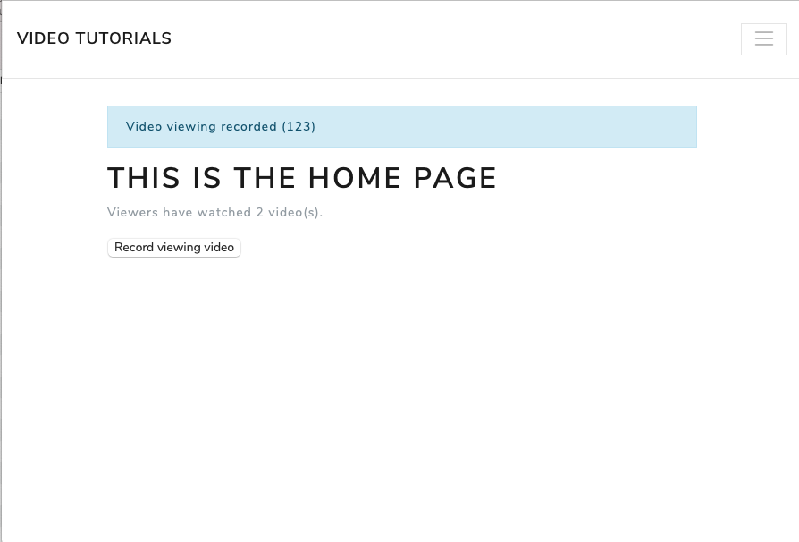
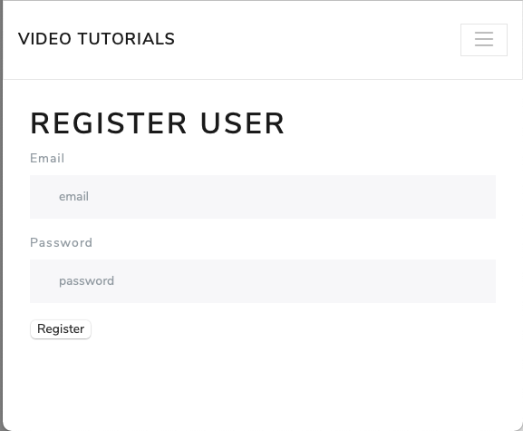
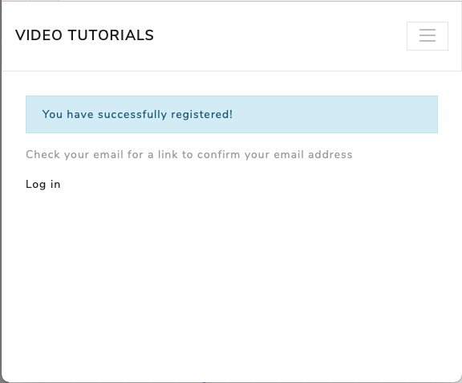

# Guided Tour

## Recording Video Views

A simple demonstration of recording video views as events and aggregating the page view data.

### Chapters (Part I - Fundaments)

1. You Have a New Project
2. Writing Messages
3. Putting Data in a Message Store
4. Projecting Data into Useful Shapes
5. Subscribing to the Message Store

### Steps

1. Visit the home page: http://localhost:4000
2. Click the "Record viewing video" button twice.



### Messages

Summary:

1. `VideoViewed` event

Details:

`VideoViewed` events are recorded in the message store to the `viewing` stream:

```
video_tutorials_dev# select * from message_store.messages where type = 'VideoViewed';
                  id                  │ stream_name │    type     │ position │ global_position │               data                │           metadata            │            time
══════════════════════════════════════╪═════════════╪═════════════╪══════════╪═════════════════╪═══════════════════════════════════╪═══════════════════════════════╪════════════════════════════
 9e0e2394-ea05-45db-8cc4-639079c01e79 │ viewing-123 │ VideoViewed │        0 │               6 │ {"user_id": 0, "video_id": "123"} │ {"user_id": 0, "trace_id": 0} │ 2021-08-04 20:05:11.884972
 7b0290e3-a4ad-403f-b9e3-4793c1f83a56 │ viewing-123 │ VideoViewed │        1 │              10 │ {"user_id": 0, "video_id": "123"} │ {"user_id": 0, "trace_id": 0} │ 2021-08-04 20:05:18.064807
```

### View Data

`VideoViewed` events are aggregated in the `pages` table:

```
video_tutorials_dev# select * from pages;
                  id                  │ name │                       data
══════════════════════════════════════╪══════╪══════════════════════════════════════════════════
 f5e01e2e-9aaf-4122-a7a3-f4808af453cd │ home │ {"videos_watched": 2, "last_view_processed": 10}
```
## Registering Users

Demonstrate the registration of a user by writing a command and an event. User credential view
data is aggregated based on the registered event.

### Chapters (Part II - Fleshing Out the System)

6. Registering Users
7. Implementing Your First Component
8. Authenticating Users

### Steps

1. Visit the registration page: http://localhost:4000/register
2. Complete the registration form (e.g. email:jane@example.com, password:adminadmin)




### Messages

Summary:

1. `identity:command` - `Register`
2. `identity` - `Registered`

Details:

`Register` commands are written in message store to the `identity` command stream:

```
video_tutorials_dev# select * from message_store.messages where type = 'Register';

                  id                  │                      stream_name                      │   type   │ position │ global_position │                                                                               data                                                                                │                                                metadata
══════════════════════════════════════╪═══════════════════════════════════════════════════════╪══════════╪══════════╪═════════════════╪═══════════════════════════════════════════════════════════════════════════════════════════════════════════════════════════════════════════════════════════════════╪═════════════════════════════════════════════════════════════════
 24729a4d-dcc0-4600-a378-866200591bb4 │ identity:command-6106fbf0-8c92-4493-bdd4-309f62bcca29 │ Register │        0 │              14 │ {"email": "jane@example.com", "user_id": "6106fbf0-8c92-4493-bdd4-309f62bcca29", "password_hash": "$2a$12$BfrnrGg3vnE3GhynopOvxuoHXtOY2cSB7nkQp2lmrV01/dVFwe.Ia"} │ {"user_id": "6106fbf0-8c92-4493-bdd4-309f62bcca29", "trace_id":
```
`Registered` events are written in the message store to the `identity` stream:

```
video_tutorials_dev# select * from message_store.messages where type = 'Registered';

                  id                  │                  stream_name                  │    type    │ position │ global_position │                                                                               data                                                                                │                                                metadata
══════════════════════════════════════╪═══════════════════════════════════════════════╪════════════╪══════════╪═════════════════╪═══════════════════════════════════════════════════════════════════════════════════════════════════════════════════════════════════════════════════════════════════╪═══════════════════════════════════════════════════════════════════════
 471481e1-81e5-4f85-bbfb-5f543bbf9eab │ identity-6106fbf0-8c92-4493-bdd4-309f62bcca29 │ Registered │        0 │              15 │ {"email": "jane@example.com", "user_id": "6106fbf0-8c92-4493-bdd4-309f62bcca29", "password_hash": "$2a$12$BfrnrGg3vnE3GhynopOvxuoHXtOY2cSB7nkQp2lmrV01/dVFwe.Ia"} │ {"user_id": "6106fbf0-8c92-4493-bdd4-309f62bcca29", "trace_id": "85cd2
```

### View Data

`Registered` events are aggregated in the `user_credentials` table:

```
video_tutorials_dev# select * from user_credentials;

                  id                  │      email       │                        password_hash
══════════════════════════════════════╪══════════════════╪══════════════════════════════════════════════════════════════
 6106fbf0-8c92-4493-bdd4-309f62bcca29 │ jane@example.com │ $2a$12$BfrnrGg3vnE3GhynopOvxuoHXtOY2cSB7nkQp2lmrV01/dVFwe.Ia
```

## Sending an Email

Demonstrate an autonomous component writing a command for another autonomous component and receiving an event as
a notification.

### Chapters (Part II - Fleshing Out the System)

9. Adding an Email Component

### Steps

No steps required, the messages were created in the previous steps.

## Building the Video Publishing Component

### Chapters (Part II - Fleshing Out the System)

10. Performing Background Jobs with Microservices
11. Building Async-Aware User Interfaces

### Messages

Summary:

1. `sendEmail:command` - `Send`
2. `sendEmail` - `Sent`
3. `identity` - `RegistrationEmailSent`

Details:

`Send` command is written in the message store to the `sendEmail:command` stream:

```
video_tutorials_dev# select * from message_store.messages where type = 'Send';

                  id                  │                      stream_name                       │ type │ position │ global_position │                                                                         data                                                                         │
══════════════════════════════════════╪════════════════════════════════════════════════════════╪══════╪══════════╪═════════════════╪══════════════════════════════════════════════════════════════════════════════════════════════════════════════════════════════════════════════════════╪═════════════════════════════════════════════════════════════════════════════════
 b5b42b58-c4c9-4632-be62-bba0d6992bc1 │ sendEmail:command-22d34e59-dab0-5525-ab97-4ecdf8d21c83 │ Send │        0 │              17 │ {"to": "jane@example.com", "html": "<p>Foo</p>", "text": "Foo", "subject": "You're Registered!", "email_id": "22d34e59-dab0-5525-ab97-4ecdf8d21c83"} │ {"user_id": "6106fbf0-8c92-4493-bdd4-309f62bcca29", "trace_id": "85cd2ea4-7e40-4
```

`Sent` event is written in the message store to the `sendEmail` stream:

```
video_tutorials_dev# select * from message_store.messages where type = 'Sent';

                  id                  │                  stream_name                   │ type │ position │ global_position │                                                                         data                                                                         │                                                                                    metad
══════════════════════════════════════╪════════════════════════════════════════════════╪══════╪══════════╪═════════════════╪══════════════════════════════════════════════════════════════════════════════════════════════════════════════════════════════════════════════════════╪═════════════════════════════════════════════════════════════════════════════════════════
 a333d973-5f64-4b95-a71a-694d6d7d1b59 │ sendEmail-22d34e59-dab0-5525-ab97-4ecdf8d21c83 │ Sent │        0 │              24 │ {"to": "jane@example.com", "html": "<p>Foo</p>", "text": "Foo", "subject": "You're Registered!", "email_id": "22d34e59-dab0-5525-ab97-4ecdf8d21c83"} │ {"user_id": "6106fbf0-8c92-4493-bdd4-309f62bcca29", "trace_id": "85cd2ea4-7e40-4a44-aee7
```

`RegistrationEmailSent` event is written in the message store to the `identity` stream:

```
video_tutorials_dev# select * from message_store.messages where type = 'RegistrationEmailSent';

                  id                  │                  stream_name                  │         type          │ position │ global_position │                                                  data                                                   │                                                metadata                                                 │
══════════════════════════════════════╪═══════════════════════════════════════════════╪═══════════════════════╪══════════╪═════════════════╪═════════════════════════════════════════════════════════════════════════════════════════════════════════╪═════════════════════════════════════════════════════════════════════════════════════════════════════════╪════════════
 3b48fb6d-2c91-469e-8a7e-a8f4883657dc │ identity-6106fbf0-8c92-4493-bdd4-309f62bcca29 │ RegistrationEmailSent │        1 │              28 │ {"user_id": "6106fbf0-8c92-4493-bdd4-309f62bcca29", "email_id": "22d34e59-dab0-5525-ab97-4ecdf8d21c83"} │ {"user_id": "6106fbf0-8c92-4493-bdd4-309f62bcca29", "trace_id": "85cd2ea4-7e40-4a44-aee7-766e21aee549"} │ 2021-08-07
```

## Transcoding Videos
## Publishing Videos - Creators' Portal
## Async-Aware User Interfaces